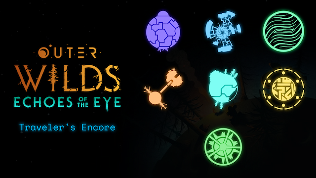

# Traveler's Encore

> "Come, sit with me, my fellow traveler. Let's sit together and watch the stars die."

**Outer Wilds** is a phenomenal video game in every aspect - visually, narratively, thematically, and in gameplay. It is a space exploration game which has evoked feelings in me I never knew I could feel. I want to sing and scream and shout praises for this game and the trillion minute details hidden in plain view. But because the game is based on exploration and discovering secrets, Outer Wilds players struggle to talk about this game without spoiling any detail.

The one way we can communicate freely however, is via music. [This website is my love letter to the Outer Wilds community and developers for the unforgettable experience I've had](https://travelers-encore.netlify.app).



This was my first Indie game, and boy, did I fall in love with it. I started the game in January 2024, in the final semester of college. Nearly 8 hours a day, for two weeks, and I missed out on a bunch of evaluatives. And you know what? I'd do it all again in a heartbeat. I wish I could.

# Developing Locally

The site is built with plain old HTML, CSS and JavaScript. You don't need anything more than a browser to contribute to this project. Clone the repository locally with:

```bash
git clone https://github.com/aryanpingle/Travelers-Encore.git
cd Travelers-Encore
```

That's it. Open `index.html` in a browser and you're good to go!